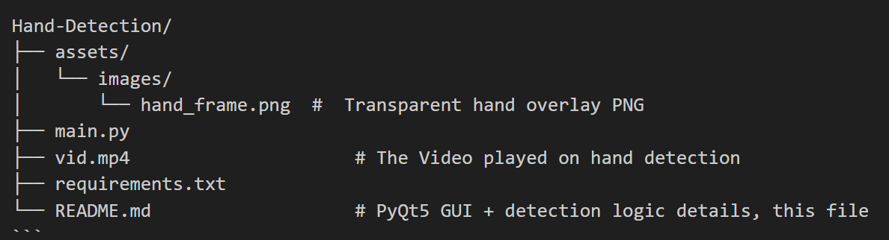
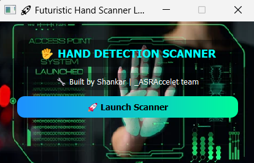
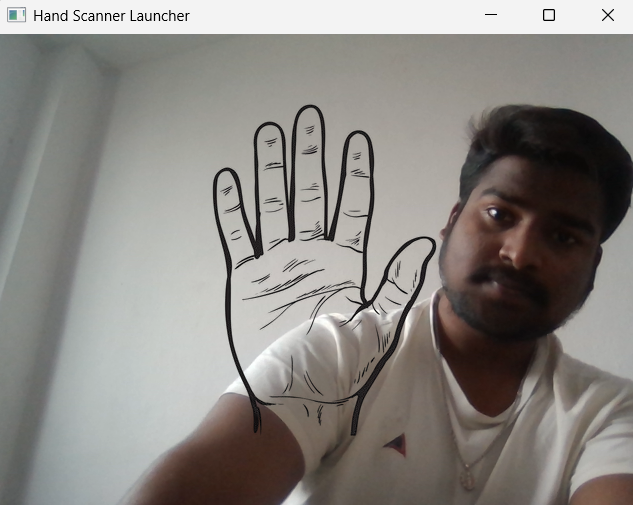
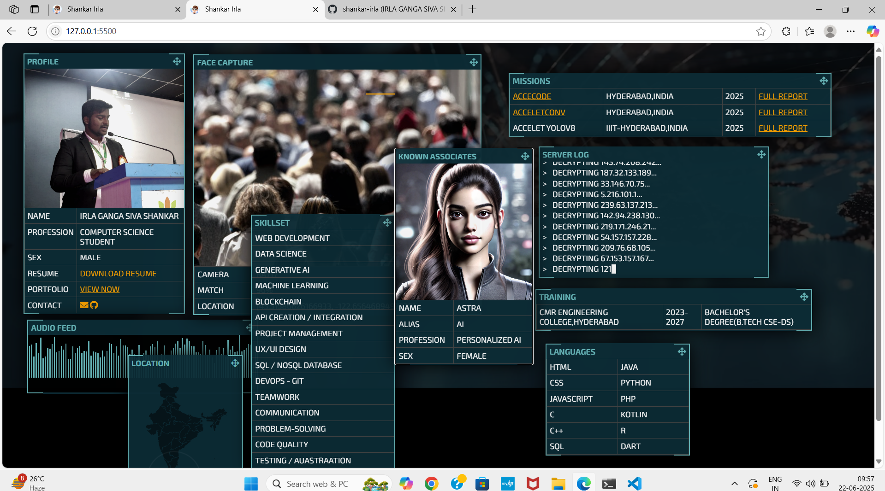

# 👋 Hand Detection Application

This Python application uses OpenCV and MediaPipe to detect when a user's hand is placed inside a designated area on the screen. Once detected, it plays a fullscreen video with sound and automatically opens a LinkedIn profile either:

- after the video ends (if triggered), or
- directly when the user exits the app without interaction.

## 🧾 License

This project is licensed under the [MIT License](LICENSE).


## ✨ Features

- Real-time webcam hand detection using MediaPipe
- Transparent hand overlay UI guide
- Fullscreen video playback with audio (`ffpyplayer`)
- Auto-redirect to LinkedIn profile after video or on exit
- Clean exit with ESC key

## 📦 Requirements

Install all dependencies and all required Python packages using:

```bash
pip install -r requirements.txt
```

## 📁 Project Structure





## 🚀 How to Run

1. Ensure `hand_frame.png` and `vid.mp4` are present in the correct folders.
2. Launch the application:

```bash
python main.py
```

3. A webcam window will appear with a hand frame overlay.
4. Place your hand within the frame to trigger the scanner.
5. Press `ESC` anytime to exit (this will also open the LinkedIn profile).

---

## 📸 Screenshots

### 🖥️ GUI Welcome Screen


### ✋ Hand Detection Scanner


### 📽️ Fullscreen Video Output



## 🌐 LinkedIn

After the video ends or program exits, it opens:

➡️ [Shankar Irla on LinkedIn](https://www.linkedin.com/in/shankar-irla)

---

## 🛠 Built With

- [OpenCV](https://opencv.org/)
- [MediaPipe](https://google.github.io/mediapipe/)
- [ffpyplayer](https://github.com/matham/ffpyplayer)
- [Python](https://www.python.org/)

---

## 🧑‍💻 Developer

**Made with ❤️ by Shankar Irla**  
_@ ASRAccelet | AI-ML Developer_

---